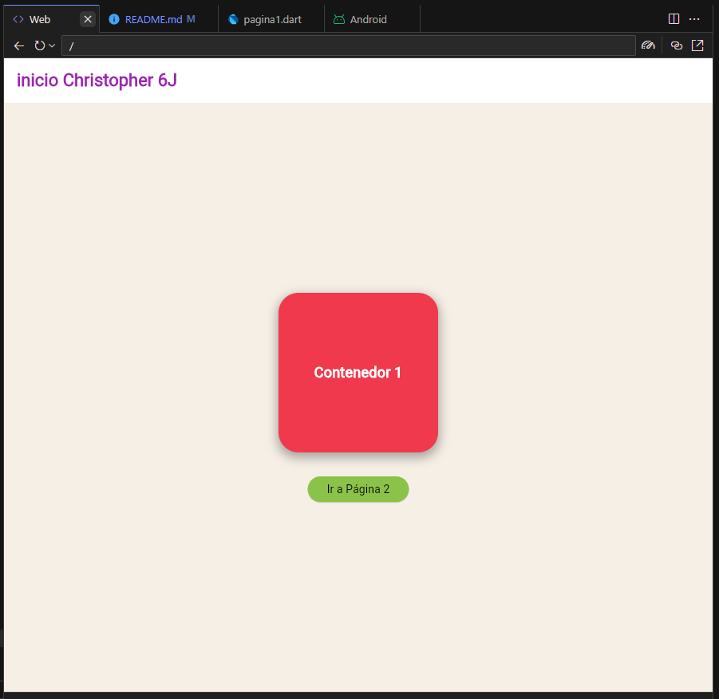
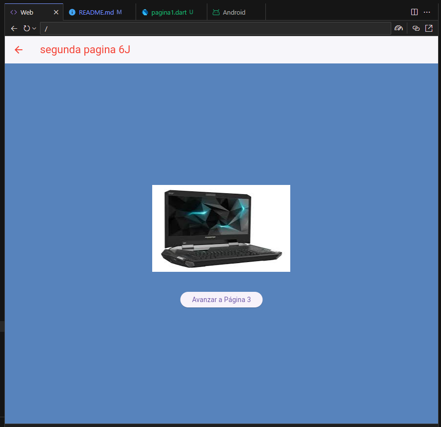
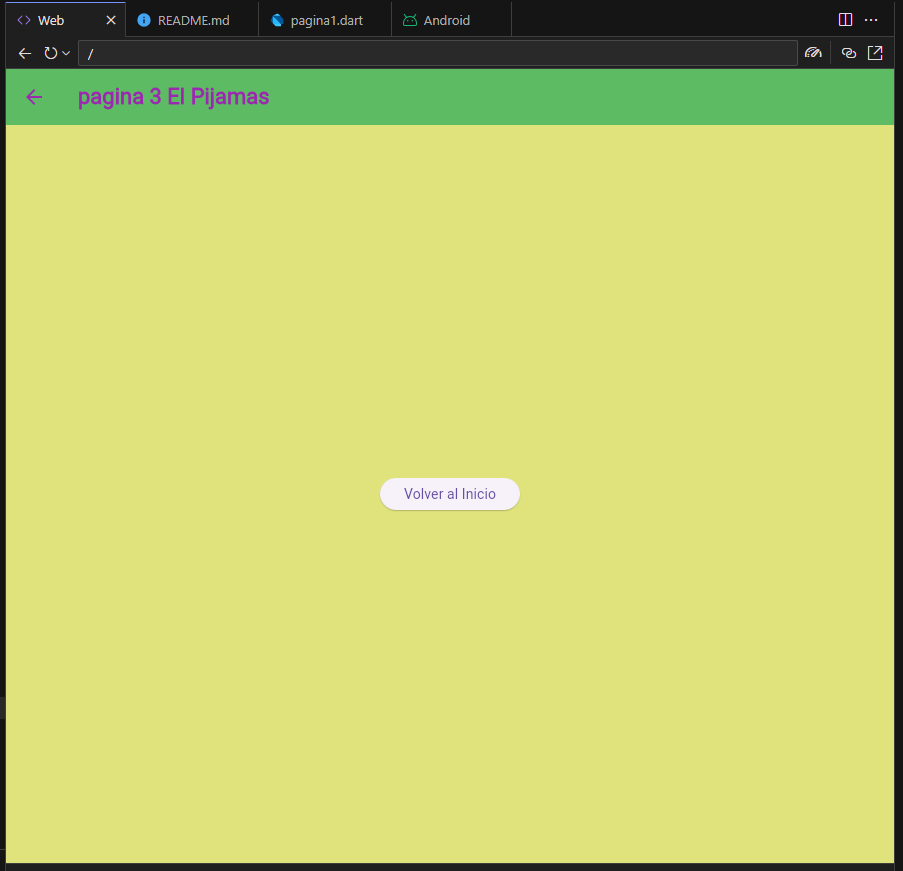
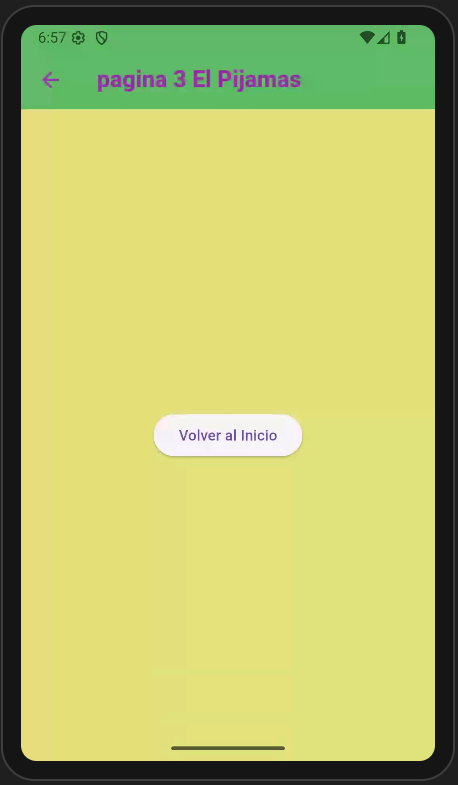

# Navegacion entre paginas con Flutter
#Christopher Lopez Gpo 6J
#my prompt o pregunta AI

lenguaje Dart flutter, nivel principiante, navegacion entre 3 paginas utilizando rutas nombradas, desde main llamar a la pagina1, en la pagina 1 en appbar mostrar el texto "inicio Christopher 6J" en color morado, color de fondo azul pastel, iconos blancos, en body un contenedor redondeado color rojo fuerte de 200 por 200 con texto negro y centrado, y un boton de color verde claro texto negro para seleccionar pagina 2, en la pagina 2 un appbar con texto rojo "segunda pagina 6J"fondo blanco y los titulos en rojo, en body una imagen desde la red, y un boton para avanzar a la pagina 3, en la pagina 3 en appbar un texto morado "pagina 3 El Pijamas", color de fondo #E0E27C, todo en un solo archivo, elegante y atractivo

## pantallas web 

## pantalla en android

